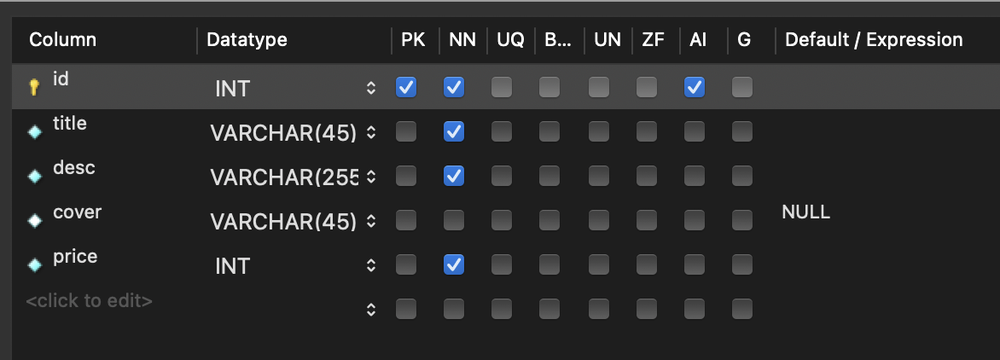

# Book Shop Website with React and MySQL
This is a demo website of an imaginary Book Shop. The front-end of the website has been coded using React and the back-end uses MySQL.

This was coded by following a tutorial by [Lama Dev on YouTube](https://youtu.be/fPuLnzSjPLE).

## Steps to run this code
1. Install NodeJS, MySQL and the MySQL Workbench
2. Create two terminal sessions, one for each folder of the project
3. Run 'npm i' to install all libraries
4. In MySQL Workbench, create a database called 'test'
5. Inside the database, add a table called 'books'
6. Enter the following properties for the table:

7. Create a '.env' file inside the backend folder of the project
8. In the '.env file', add the line `MYSQL_PASSWORD=""` and enter your password in the quotes 
8. Run 'npm start' on both terminals created in Step 2